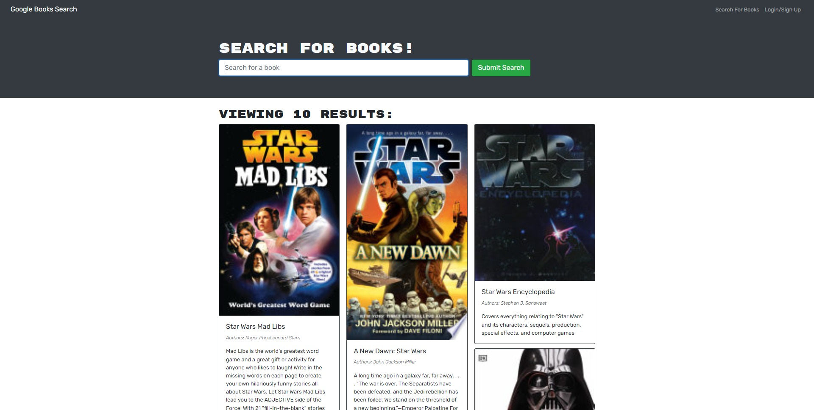

# Module 21 Book Searcher challenge

## Description

This is Adrian Jimenez's module 21 MERN stack Book Searcher challenge submission. 

This project is a MERN stack book searcher application that allows the user to fetch books from the google books api, and display them onto a page. It features authentication which the user can use to sign up or log in, and if they are logged in, they are able to save books to a mongoDB database using GraphQL. They can later view these books on their saved books page and edit the list if necessary.

## Table of Contents

- [Installation](#installation)
- [Languages](#languages)
- [Usage](#usage)
- [Credits](#credits)
- [License](#license)
- [Contributing](#contributing)
- [Questions](#questions)

## Installation

In order to install this project, download all files and have node.js installed on your machine. Navigate to the root directory and type: 

    npm install

Once all dependencies have been downloaded, you can start the react development server by typing npm run develop or start the application by typing npm start

## Technologies Used

* JavaScript
* Node.JS
* React
* CSS
* HTML
* ApolloServer
* GraphQL
* react-router-dom
* Express
* MongoDB

## Usage

In order to use this project, please make sure you have node.js intalled on your machine. Once that is set up, simply execute npm start and the application should start. Alternatively, visit the site [here](https://puppetaj.github.io/20-ReactPortfolio-AJ/)

## Credits

* Adrian Jimenez

## License

This project is licensed under the MIT License. See [LICENSE.md](./LICENSE.md) for more details.

---

## Contributing

This project follows the contributor covenant contribution guidelines. See [here](https://www.contributor-covenant.org/version/2/1/code_of_conduct/) 

## Questions

If you have any questions or concerns visit my [github](https://github.com/PuppetAJ) or send me an email at <adrianjimenez1950@gmail.com>. 

